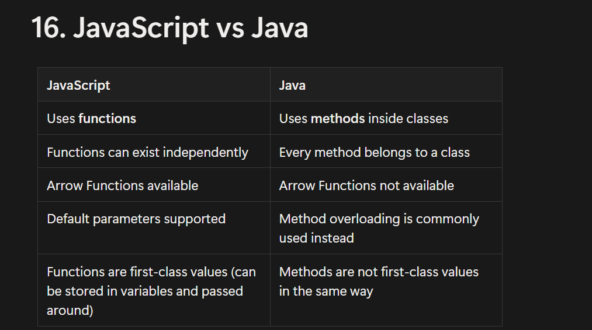

# JavaScript Fundamentals - Lesson 05

## Functions

A function is a reusable block of code that performs a specific task and executes only when it is called.

---

## 1. What is a Function?

### Definition

A **function** is a reusable block of code that performs a specific task and executes only when it is called.

**Simple Words**

A function is a reusable piece of code that avoids repetition.

---

## 2. Why Use Functions?

### Without a Function

```javascript
console.log("Welcome Ammar");
console.log("Welcome Ali");
console.log("Welcome Ahmed");
```

### With a Function

```javascript
function greet(name) {
    console.log(`Welcome ${name}`);
}

greet("Ammar");
greet("Ali");
greet("Ahmed");
```

### Benefits

- Code Reusability
- Less Repetition
- Easy Maintenance
- Better Readability

---

## 3. Function Declaration

The most common way to create a function.

### Syntax

```javascript
function functionName() {

}
```

### Example

```javascript
function greet() {
    console.log("Hello");
}
```

---

## 4. Function Call

A function executes **only when it is called**.

```javascript
function greet() {
    console.log("Hello");
}

greet();
```

**Output**

```javascript
Hello
```

---

## 5. Parameters vs Arguments

|                 Parameter                   |                  Argument                     |
|---------------------------------------------|-----------------------------------------------|
| Variable written in the function definition | Actual value passed while calling the function|
| Receives data                               | Sends data|

### Example

```javascript
function greet(name) {
    console.log(name);
}

greet("Ammar");
```

- **Parameter:** `name`
- **Argument:** `"Ammar"`

---

## 6. Multiple Parameters

```javascript
function student(name, age) {
    console.log(name);
    console.log(age);
}

student("Ammar", 24);
```

**Output**

```javascript
Ammar
24
```

---

## 7. The `return` Keyword ⭐

The **return** keyword sends a value back to the caller.

```javascript
function add(a, b) {
    return a + b;
}

const result = add(5, 3);

console.log(result);
```

**Output**

```javascript
8
```

---

## 8. `console.log()` vs `return` ⭐

| `console.log()`                | `return` |
|--------------------------------|----------|
| Prints the value on the screen | Sends the value back to the caller |
| Mainly used for debugging      | Used to reuse or store the result |
| Returns `undefined`            | Returns the specified value |

### Example

```javascript
function add(a, b) {
    console.log(a + b);
}

const result = add(5, 5);

console.log(result);
```

**Output**

```javascript
10
undefined
```

### Why?

- `10` is printed by `console.log()`.
- Since no value is returned, JavaScript automatically returns `undefined`.

---

## 9. Every Function Returns Something ⭐

If you don't write:

```javascript
return value;
```

JavaScript automatically behaves like this:

```javascript
return undefined;
```

### Example

```javascript
function greet() {
    console.log("Hello");
}
```

Internally JavaScript treats it as:

```javascript
function greet() {
    console.log("Hello");
    return undefined;
}
```

---

## 10. Function Expression

A **Function Expression** is a function assigned to a variable.

```javascript
const greet = function () {
    console.log("Hello");
};

greet();
```

Unlike Function Declarations, Function Expressions are commonly stored in **`const`** variables to prevent accidental reassignment.

---

## 11. Arrow Functions ⭐⭐⭐

Arrow Functions are the modern and shorter way to write functions in JavaScript.

### Regular Function

```javascript
function add(a, b) {
    return a + b;
}
```

### Arrow Function

```javascript
const add = (a, b) => {
    return a + b;
};
```

### Implicit Return

If the function contains only one expression, curly braces and `return` can be omitted.

```javascript
const add = (a, b) => a + b;
```

### Single Parameter

Parentheses are optional when there is only one parameter.

```javascript
const square = n => n * n;
```

### No Parameters

```javascript
const greet = () => "Hello";
```

### Calling an Arrow Function

```javascript
const greet = name => `Hello ${name}`;

console.log(greet("Ammar"));
```

---

## 12. Default Parameters

Default parameters provide a value when no argument is passed.

```javascript
function greet(name = "Guest") {
    console.log(name);
}

greet();
```

**Output**

```javascript
Guest
```

```javascript
greet("Ammar");
```

**Output**

```javascript
Ammar
```

---

## 13. Function Scope

Variables declared inside a function have **local scope** and cannot be accessed outside the function.

```javascript
function test() {
    let age = 24;
}

console.log(age);
```

**Output**

```javascript
ReferenceError: age is not defined
```

---

## 14. Common Cases of `undefined`

### Variable Declared but Not Initialized

```javascript
let age;

console.log(age);
```

**Output**

```javascript
undefined
```

### Accessing a Missing Object Property

```javascript
const user = {
    name: "Ali"
};

console.log(user.age);
```

**Output**

```javascript
undefined
```

### Function Without `return`

```javascript
function test() {
    console.log("Hello");
}

const result = test();

console.log(result);
```

**Output**

```javascript
Hello
undefined
```

---

## 15. Function Reassignment ⭐

### Function Declaration

A Function Declaration is **not declared using `const`**, so its identifier can be reassigned.

```javascript
function greet() {
    console.log("Hello");
}

greet = 10;

console.log(greet);
```

**Output**

```javascript
10
```

Calling it afterwards:

```javascript
greet();
```

**Output**

```javascript
TypeError: greet is not a function
```

> Although possible, reassigning Function Declarations is considered **bad practice**.

### Function Expression

```javascript
const greet = function () {
    console.log("Hello");
};

// greet = 10;
```

**Output**

```javascript
TypeError: Assignment to constant variable.
```

### Arrow Function

```javascript
const greet = () => "Hello";

// greet = 10;
```

**Output**

```javascript
TypeError: Assignment to constant variable.
```

### Best Practice

Declare Function Expressions and Arrow Functions using **`const`** to prevent accidental reassignment.

---

## 16. JavaScript vs Java

| JavaScript | Java |
|------------|------|
| Uses **functions** | Uses **methods** inside classes |
| Functions can exist independently | Every method belongs to a class |
| Functions can be assigned to variables | Methods cannot be assigned to variables |
| Arrow Functions are available | Arrow Functions are not available |
| Default parameters are supported | Method overloading is commonly used instead |
| Functions are first-class values | Methods are not first-class values in the same way |


Use Ctrl + Left Click to open the image 


# Interview Tips

- A function is a reusable block of code.
- A function executes only when it is called.
- Parameters and Arguments are different.
- `return` sends a value back to the caller.
- `console.log()` only prints a value.
- Every JavaScript function returns a value.
- If nothing is returned, JavaScript returns `undefined`.
- Arrow Functions are the modern syntax.
- Variables declared inside a function have local scope.
- Prefer `const` for Function Expressions and Arrow Functions.

---

# ⭐ Golden Rules

1. Use functions to avoid repeating code.
2. Use `return` when the result needs to be reused.
3. Use `console.log()` mainly for debugging or displaying output.
4. Every JavaScript function returns a value (explicitly or `undefined`).
5. Prefer `const` for Function Expressions and Arrow Functions.
6. Remember the difference between Parameters and Arguments.
7. Variables declared inside a function cannot be accessed outside it.
8. Prefer Arrow Functions for most modern JavaScript code unless a regular function is more appropriate.

---

# Quick Interview Questions

### Q1. What is the difference between a Parameter and an Argument?

A parameter is declared in the function definition, while an argument is the actual value passed when calling the function.

---

### Q2. Does every JavaScript function return something?

Yes. If no value is returned explicitly, JavaScript automatically returns `undefined`.

---

### Q3. Why is `const` preferred for functions?

Because it prevents accidental reassignment and makes the code safer.

---

### Q4. What is the difference between `console.log()` and `return`?

`console.log()` displays a value on the screen, whereas `return` sends a value back to the caller.

---

### Q5. Which function syntax is preferred in modern JavaScript?

Arrow Functions are generally preferred because they are shorter and cleaner, although regular functions are still useful in specific situations.